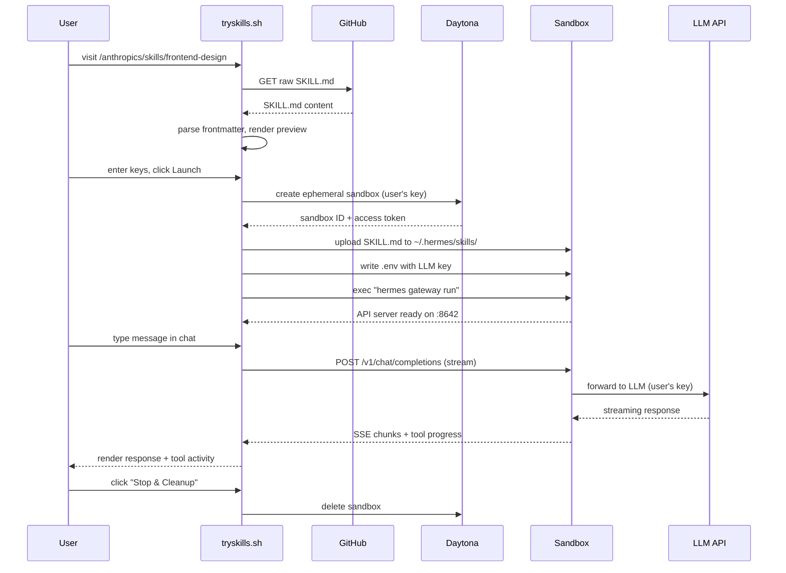

# tryskills.sh — Product Requirements Document

> **Version**: 0.1.0 (Draft)
> **Author**: Yilin Jing
> **Date**: 2026-04-19
> **Status**: Pre-MVP

---

## 1. Vision

**One URL prefix to instantly try any agent skill.**

Users discover skills on [skills.sh](https://skills.sh), GitHub, or social media. Today, trying a skill means: clone → install dependencies → configure agent → configure API keys → debug. tryskills.sh collapses this to a single URL change:

```
skills.sh/anthropics/skills/frontend-design       ← browse
tryskills.sh/anthropics/skills/frontend-design     ← try it now
```

The user adds `try` before `skills.sh` and gets a live agent session with that skill loaded — running in a cloud sandbox, powered by their own API keys.

**Analogy**: CodeSandbox is to npm packages as tryskills.sh is to agent skills.

---

## 2. Problem Statement

### The Discovery-to-Trial Gap

The agent skill ecosystem is exploding (1,400+ skills on skills.sh, 91M+ total installs), but **trying a skill before installing is impossible**. The current workflow:

1. Find a skill on skills.sh or GitHub
2. Run `npx skills add owner/repo` in your local environment
3. Hope your agent (Claude Code, Cursor, Hermes, etc.) picks it up
4. Realize you need to restart the agent session
5. Discover the skill doesn't do what you expected
6. Uninstall and repeat

**Community validation** (Reddit, 206 upvotes, 97% approval):
> "I kept finding great skills on GitHub, but evaluating them meant download → install → configure MCPs → debug. I also wasn't thrilled about running random deps locally just to see if it works."

### Who This Hurts

| Persona | Pain |
|---------|------|
| **Skill consumers** | Can't evaluate skills before installing; waste time on bad skills |
| **Skill authors** | No way to offer a "try it" button; installs ≠ actual usage |
| **Non-developers** | Completely locked out — can't use terminal to install skills |
| **Teams evaluating tools** | No standardized way to demo skills to stakeholders |

---

## 3. Solution: Zero-Infrastructure Skill Tryout

tryskills.sh is an **open-source, static web app** that lets anyone try any agent skill in their browser. The key architectural insight: **the platform itself has zero compute costs** — all LLM inference and sandbox compute is paid for by the user's own API keys.

### Core Principles

1. **Zero server cost** — Pure client-side app, deployed on Vercel/Cloudflare Pages for free
2. **User brings their own keys** — LLM API key + Sandbox API key, never sent to our servers
3. **Open source** — MIT license, fully auditable, community-driven
4. **URL-first UX** — The URL *is* the product. No accounts, no sign-ups, no onboarding
5. **Agent-agnostic foundation** — Starts with Hermes Agent, designed to support others

---

## 4. User Journey

### 4.1 Happy Path

```
┌─ User finds skill on skills.sh ────────────────────────────┐
│                                                             │
│  skills.sh/anthropics/skills/frontend-design                │
│  "311K installs · Anthropic's official frontend skill"      │
│                                                             │
│  User changes URL prefix to tryskills.sh                    │
└──────────────────────┬──────────────────────────────────────┘
                       │
                       ▼
┌─ tryskills.sh/anthropics/skills/frontend-design ────────────┐
│                                                             │
│  ┌─ Skill Preview ───────────────────────────────────┐      │
│  │ frontend-design                                   │      │
│  │ by anthropics/skills · 311K installs              │      │
│  │                                                   │      │
│  │ "Guidelines for creating beautiful, modern web    │      │
│  │  interfaces with attention to design principles"  │      │
│  └───────────────────────────────────────────────────┘      │
│                                                             │
│  ┌─ Configuration ───────────────────────────────────┐      │
│  │                                                   │      │
│  │  LLM Provider     [ OpenRouter          ▼ ]       │      │
│  │  API Key          [ sk-or-v1-•••••••••    ]       │      │
│  │  Model            [ anthropic/claude-4-s  ▼ ]     │      │
│  │                                                   │      │
│  │  Sandbox           [ Daytona             ▼ ]      │      │
│  │  API Key          [ daytona-•••••••••     ]       │      │
│  │                                                   │      │
│  │  [✓] Remember my keys (stored locally)            │      │
│  │                                                   │      │
│  │           [ ▶ Launch Agent ]                      │      │
│  └───────────────────────────────────────────────────┘      │
└──────────────────────┬──────────────────────────────────────┘
                       │
                       ▼
┌─ Agent Session ─────────────────────────────────────────────┐
│                                                             │
│  ┌─ Chat ────────────────────────────────────────────┐      │
│  │                                                   │      │
│  │  🤖 Hermes: I've loaded the frontend-design       │      │
│  │     skill. I can help you create beautiful web    │      │
│  │     interfaces. What would you like to build?     │      │
│  │                                                   │      │
│  │  You: Build me a landing page for a SaaS product  │      │
│  │       that sells AI-powered code review           │      │
│  │                                                   │      │
│  │  🤖 Hermes: [executing terminal: mkdir project]   │      │
│  │     [writing file: index.html]                    │      │
│  │     [writing file: styles.css]                    │      │
│  │     ...                                           │      │
│  │                                                   │      │
│  │  ┌──────────────────────────────┐                 │      │
│  │  │ [Send message...]        [↵] │                 │      │
│  │  └──────────────────────────────┘                 │      │
│  └───────────────────────────────────────────────────┘      │
│                                                             │
│  Session: 7m23s │ Tokens: 12.4K │ [ Stop & Cleanup ]       │
└─────────────────────────────────────────────────────────────┘
```

### 4.2 First-Time User (No Keys)

If a user arrives without any stored keys, the configuration panel shows:

- Brief explanation of what each key is for
- Direct links to get keys:
  - OpenRouter: https://openrouter.ai/keys (free tier available)
  - Daytona: https://app.daytona.io (free tier: 100 sandbox-hours/month)
- Estimated cost per session (~$0.02–0.10 depending on model)

### 4.3 Returning User

localStorage remembers their keys and preferred model. They see the skill preview and can launch immediately with one click.

---

## 5. Architecture

### 5.1 System Overview

```
┌─────────────────────────────────────────────────────────────────┐
│                        BROWSER (all logic)                      │
│                                                                 │
│  ┌──────────┐  ┌──────────────┐  ┌────────────┐  ┌──────────┐  │
│  │ URL      │  │ Config       │  │ Sandbox    │  │ Chat     │  │
│  │ Router   │→ │ Panel        │→ │ Launcher   │→ │ UI       │  │
│  │          │  │              │  │            │  │          │  │
│  │ parse    │  │ keys,model   │  │ Daytona TS │  │ OpenAI   │  │
│  │ skillPath│  │ localStorage │  │ SDK        │  │ compat   │  │
│  └────┬─────┘  └──────────────┘  └─────┬──────┘  └────┬─────┘  │
│       │                                │              │         │
└───────┼────────────────────────────────┼──────────────┼─────────┘
        │                                │              │
        ▼                                ▼              ▼
  ┌───────────┐                  ┌──────────────┐ ┌──────────┐
  │ GitHub    │                  │ Daytona API  │ │ Daytona  │
  │ Raw API   │                  │ (user's key) │ │ Sandbox  │
  │           │                  └──────┬───────┘ │          │
  │ SKILL.md  │                         │         │ hermes   │
  └───────────┘                         │         │ agent    │──→ LLM API
                                        │         │ :8642    │   (user's key)
                                        └────────→│ SKILL.md │
                                                  └──────────┘
```

### 5.2 Key Design Decisions

**Why pure client-side?**
- Zero hosting cost beyond static file serving
- User keys never touch our servers — no security liability
- No rate limits, no quotas, no scaling concerns
- Open source contributors can run locally with `npm run dev`

**Why Hermes Agent?**
- Open source (MIT), 64K+ GitHub stars
- Native skill system (SKILL.md format, compatible with agentskills.io spec)
- OpenAI-compatible API server built-in (`:8642`)
- Docker-friendly, works in Daytona sandboxes
- Skill progressive disclosure (load only when needed)

**Why Daytona?**
- TypeScript SDK works **in the browser** (with node polyfills)
- Ephemeral sandboxes with auto-cleanup
- Free tier: 100 sandbox-hours/month
- 90ms sandbox creation (with snapshots)
- Open source, active community

**Why not E2B / Modal / Fly?**
- Daytona is the only one with a browser-compatible TS SDK
- E2B is a strong future option (add in P4)
- Modal requires server-side Python
- Fly requires server-side orchestration

### 5.3 Data Flow



### 5.4 Sandbox Lifecycle

```
State Machine:
                                    
  [idle] ──Launch──→ [creating] ──ready──→ [running] ──stop──→ [cleaning]──→ [idle]
                        │                     │                    │
                        │                     │ (10min timeout)    │
                        └──error──→ [error]   └────auto-stop──────→┘
```

| State | Duration | User sees |
|-------|----------|-----------|
| `creating` | 2-5 min (cold) / 10-30s (snapshot) | Progress bar: "Installing hermes-agent..." |
| `running` | Up to 30 min | Chat interface |
| `cleaning` | ~5s | "Session ended. Sandbox deleted." |
| `error` | — | Error message + retry button |

---

## 6. Technical Specification

### 6.1 Project Structure

```
tryskills.sh/
├── src/
│   ├── app/
│   │   ├── page.tsx                      # Homepage: URL input + popular skills
│   │   ├── layout.tsx                    # Root layout with theme, fonts
│   │   ├── [...skillPath]/
│   │   │   └── page.tsx                  # Dynamic route: config + launch + chat
│   │   └── api/                          # (empty — no server routes needed)
│   │
│   ├── components/
│   │   ├── ui/                           # shadcn/ui primitives
│   │   ├── skill-preview.tsx             # SKILL.md frontmatter display
│   │   ├── config-panel.tsx              # API keys + model selector
│   │   ├── provider-selector.tsx         # LLM provider dropdown
│   │   ├── model-selector.tsx            # Model list per provider
│   │   ├── sandbox-selector.tsx          # Sandbox provider (Daytona, future: E2B)
│   │   ├── launch-button.tsx             # Launch with progress states
│   │   ├── sandbox-status.tsx            # Sandbox lifecycle indicator
│   │   ├── chat-interface.tsx            # Message list + input
│   │   ├── chat-message.tsx              # Individual message (user/assistant/tool)
│   │   ├── tool-progress.tsx             # Hermes tool execution cards
│   │   ├── session-stats.tsx             # Timer, token count, cost estimate
│   │   └── popular-skills.tsx            # Homepage skill cards
│   │
│   ├── lib/
│   │   ├── skill-resolver.ts             # URL path → GitHub raw → parsed SKILL.md
│   │   ├── skill-parser.ts              # YAML frontmatter + markdown body parser
│   │   ├── sandbox/
│   │   │   ├── manager.ts               # Abstract sandbox interface
│   │   │   ├── daytona.ts               # Daytona SDK implementation
│   │   │   └── types.ts                 # Sandbox state, config types
│   │   ├── hermes/
│   │   │   ├── client.ts                # OpenAI-compatible API client
│   │   │   ├── installer.ts             # Commands to install + configure hermes in sandbox
│   │   │   └── types.ts                 # Hermes-specific types (tool progress, etc.)
│   │   ├── providers/
│   │   │   ├── registry.ts              # Provider definitions (OpenRouter, Anthropic, etc.)
│   │   │   └── models.ts               # Model lists per provider
│   │   ├── key-store.ts                 # localStorage encrypted key management
│   │   └── cost-estimator.ts            # Token → cost calculation per model
│   │
│   └── types/
│       ├── skill.ts                     # SKILL.md frontmatter schema
│       ├── message.ts                   # Chat message types
│       └── config.ts                    # User config types
│
├── public/
│   ├── og-image.png                     # Open Graph image
│   └── favicon.ico
│
├── PRD.md                               # This document
├── package.json
├── next.config.ts
├── tailwind.config.ts
├── tsconfig.json
└── README.md
```

### 6.2 URL Routing

| URL Pattern | Behavior |
|-------------|----------|
| `tryskills.sh/` | Homepage with URL input + popular skills |
| `tryskills.sh/{owner}/{repo}/{skill}` | Skill tryout page (mirrors skills.sh URL structure) |
| `tryskills.sh/?url=https://github.com/...` | Direct GitHub URL support |
| `tryskills.sh/?gist=abc123` | GitHub Gist skill support (future) |

The `[...skillPath]` catch-all route handles all skill paths. The resolver maps:

```
/anthropics/skills/frontend-design
→ owner: "anthropics"
→ repo:  "skills"
→ skill: "frontend-design"
→ raw:   "https://raw.githubusercontent.com/anthropics/skills/main/frontend-design/SKILL.md"
```

### 6.3 Supported LLM Providers

| Provider | API Base | Models | Notes |
|----------|----------|--------|-------|
| OpenRouter | `https://openrouter.ai/api/v1` | 200+ models | Best default: one key, all models |
| Anthropic | `https://api.anthropic.com/v1` | Claude family | Direct, no markup |
| OpenAI | `https://api.openai.com/v1` | GPT family | Direct |
| Google AI | `https://generativelanguage.googleapis.com/v1beta` | Gemini family | Free tier available |

Provider config is passed to hermes agent's `.env` + `config.yaml` inside the sandbox.

### 6.4 Sandbox Setup Script

The sequence of commands executed inside the Daytona sandbox after creation:

```bash
# 1. Install hermes-agent (or use snapshot)
pip install hermes-agent[all]

# 2. Create config directory
mkdir -p ~/.hermes/{skills,sessions,logs,memories}

# 3. Write .env with user's LLM key
cat > ~/.hermes/.env << EOF
{PROVIDER}_API_KEY={user_api_key}
API_SERVER_ENABLED=true
API_SERVER_HOST=0.0.0.0
API_SERVER_PORT=8642
API_SERVER_KEY={session_token}
LLM_MODEL={user_selected_model}
EOF

# 4. Write config.yaml
cat > ~/.hermes/config.yaml << EOF
model: {user_selected_model}
terminal:
  backend: local
agent:
  max_iterations: 50
approvals:
  mode: yolo
EOF

# 5. Inject the skill
mkdir -p ~/.hermes/skills/{skill_name}
# (SKILL.md content uploaded via Daytona SDK)

# 6. Start gateway with API server
hermes gateway run &

# 7. Wait for API server ready
until curl -sf http://localhost:8642/health; do sleep 1; done
```

### 6.5 Chat Protocol

The frontend connects to hermes agent's OpenAI-compatible API running inside the sandbox.

**Request**:
```json
{
  "model": "hermes-agent",
  "messages": [
    {"role": "system", "content": "You have the /{skill-name} skill loaded. Use it proactively."},
    {"role": "user", "content": "Build me a landing page"}
  ],
  "stream": true
}
```

**Streaming response** includes:
- Standard `chat.completion.chunk` events (text tokens)
- `hermes.tool.progress` events (tool start/end, command output)

The chat interface renders both text and tool activity inline.

### 6.6 Security Model

| Concern | Mitigation |
|---------|------------|
| API keys on our server | Keys **never** leave the browser. All API calls are client-side. |
| API keys in localStorage | Optional. User must check "Remember keys". Keys can be encrypted with a passphrase (future). |
| Malicious skills | Skills run inside an isolated Daytona sandbox, not on user's machine. Sandbox is ephemeral and auto-deleted. |
| Sandbox escape | Daytona provides namespace isolation. User's own Daytona account — their risk boundary. |
| Code injection via SKILL.md | SKILL.md is rendered as preview only. Execution happens in sandbox, not browser. |
| Open source auditability | MIT license. Every line of code is visible. |

---

## 7. Metrics

### 7.1 Success Metrics

| Metric | Target (3 months) | How Measured |
|--------|-------------------|--------------|
| Skills tried | 1,000 unique skills | Client-side analytics (Plausible, no cookies) |
| Sessions launched | 5,000 total | Client-side counter |
| Avg session duration | > 3 minutes | Client-side timer |
| GitHub stars | 500+ | GitHub API |
| Return rate | > 30% use "Remember keys" | localStorage presence |

### 7.2 Non-Goals for MVP

- User accounts / authentication
- Server-side anything
- Skill ratings or reviews
- Skill editing or creation
- Multi-agent support (only Hermes for now)
- Mobile optimization (desktop-first)

---

## 8. Implementation Phases

### Phase 0: Foundation (Day 1)

- [x] Initialize repo, PRD
- [ ] Next.js 15 + Tailwind + shadcn/ui scaffold
- [ ] URL routing: `[...skillPath]` catch-all
- [ ] Skill resolver: path → GitHub raw URL → fetch SKILL.md
- [ ] SKILL.md parser: YAML frontmatter + markdown body
- [ ] Skill preview component

### Phase 1: Configuration (Day 2)

- [ ] Provider registry (OpenRouter, Anthropic, OpenAI, Google)
- [ ] Model selector per provider
- [ ] Sandbox provider selector (Daytona)
- [ ] API key input with show/hide toggle
- [ ] localStorage key persistence
- [ ] "Remember keys" checkbox

### Phase 2: Sandbox Launch (Day 3-4)

- [ ] Daytona TS SDK integration (with Vite/Next.js node polyfills)
- [ ] Sandbox lifecycle manager (create → configure → start hermes → ready)
- [ ] Progress UI during sandbox creation
- [ ] SKILL.md upload to sandbox
- [ ] Hermes .env + config.yaml generation
- [ ] Gateway startup + health check polling
- [ ] Error handling + retry

### Phase 3: Chat Interface (Day 5)

- [ ] OpenAI-compatible streaming chat client
- [ ] Message list (user, assistant, tool roles)
- [ ] Tool progress rendering (hermes.tool.progress SSE events)
- [ ] Session stats (timer, token count)
- [ ] Stop & cleanup button
- [ ] Sandbox auto-stop on browser close (beforeunload)

### Phase 4: Optimization (Day 6-7)

- [ ] Daytona snapshot: `tryskills-hermes-base` (pre-installed hermes)
- [ ] Snapshot-based sandbox creation (10-30s instead of 2-5min)
- [ ] Homepage: popular skills grid (scraped from skills.sh)
- [ ] URL input field on homepage
- [ ] Open Graph / SEO meta tags per skill
- [ ] README with demo GIF

### Phase 5: Polish & Launch (Day 8+)

- [ ] Dark theme (terminal aesthetic)
- [ ] Keyboard shortcuts (Cmd+Enter to send, Esc to stop)
- [ ] Cost estimation display per message
- [ ] Error states for all failure modes
- [ ] Product Hunt listing preparation
- [ ] r/ClaudeAI, r/LocalLLaMA launch posts

---

## 9. Open Questions

| # | Question | Options | Decision |
|---|----------|---------|----------|
| 1 | Daytona TS SDK browser support maturity? | Test in P2; fallback to thin API proxy on Vercel Edge | TBD |
| 2 | Hermes install time in cold sandbox? | May be 2-5 min; snapshot critical for UX | Snapshot in P4 |
| 3 | How to handle skills with `scripts/` and `references/`? | Upload entire skill directory, not just SKILL.md | Implement in P2 |
| 4 | Should we support non-skills.sh GitHub repos? | Yes, any repo with SKILL.md in a directory | P0 |
| 5 | Rate limiting without a backend? | Rely on Daytona's per-key limits | Acceptable for MVP |
| 6 | What if Daytona free tier changes? | E2B as backup; document self-hosted Daytona option | Monitor |

---

## 10. Competitive Landscape

| Product | What It Does | Why tryskills.sh Is Different |
|---------|-------------|-------------------------------|
| skills.sh | Browse + install skills | No tryout; install-only |
| GPT Store | Try custom GPTs | Walled garden; no code execution |
| MCP Playground | Test MCP servers | MCP only; no agent skills |
| Claude Skills Directory | Search skills + sandbox | Community project; not URL-based |
| CodeSandbox | Try npm packages | For code, not agent skills |

**tryskills.sh occupies an empty niche**: URL-based, agent-agnostic, zero-cost skill tryout.

---

## 11. Risk Register

| Risk | Likelihood | Impact | Mitigation |
|------|-----------|--------|------------|
| Daytona TS SDK doesn't work in browser | Medium | High | P2 spike; fallback to Vercel Edge Function as thin proxy |
| Hermes too slow to install in sandbox | High | Medium | Daytona snapshot (P4); show estimated wait time |
| Users won't enter API keys | Medium | High | Free-tier guidance; cost estimates; "it costs ~$0.05" messaging |
| Skills.sh changes URL structure | Low | Medium | Resolver is a thin abstraction; easy to update |
| Security concern about running unknown skills | Medium | Medium | Skills run in isolated sandbox, not user's machine; clear messaging |
| Daytona free tier removed | Low | High | Support E2B as alternative; document self-hosted option |

---

## 12. References

- [Agent Skills Specification](https://agentskills.io/specification)
- [skills.sh](https://skills.sh) — The Agent Skills Directory by Vercel
- [Hermes Agent](https://hermes-agent.nousresearch.com/) — Open-source agent by Nous Research
- [Hermes Agent API Server](https://hermes-agent.nousresearch.com/docs/user-guide/features/api-server)
- [Hermes WebUI](https://github.com/nesquena/hermes-webui) — Web frontend for Hermes Agent
- [Daytona SDK (TypeScript)](https://www.daytona.io/docs/en/typescript-sdk/)
- [Daytona Getting Started](https://www.daytona.io/docs/en/getting-started/)
- [tryskills.sh Market Research](.tmp/2026-04-19/try-skill-ai-research.md)
